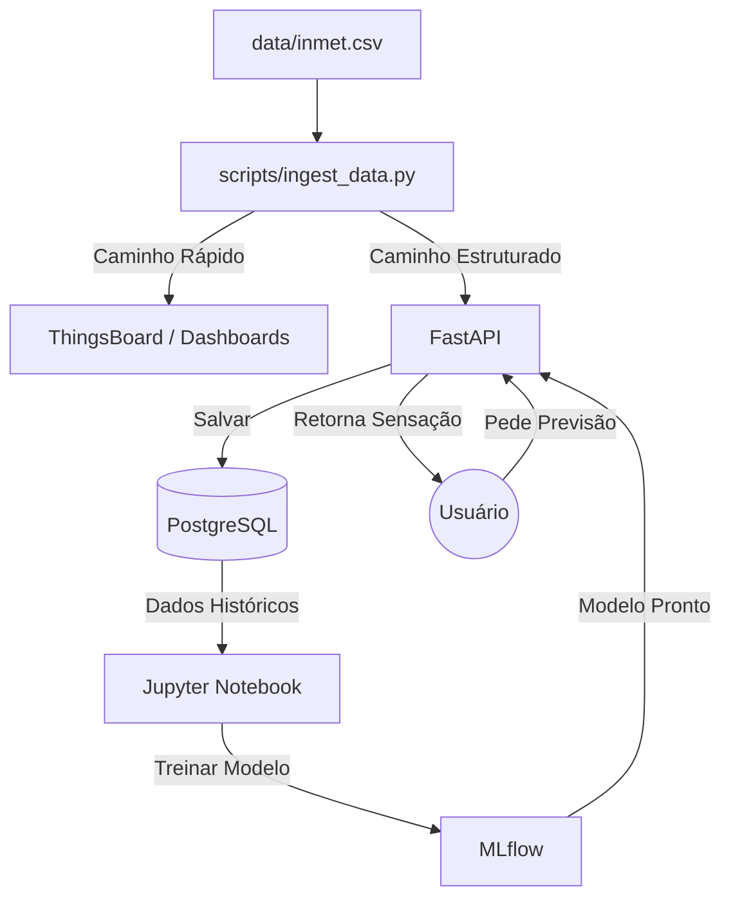

# 🔄 Fluxo de Dados e Arquitetura do Sistema

Este documento descreve o "Caso de Uso Real" do sistema, explicando como os dados fluem através dos componentes e qual o papel de cada um na arquitetura.

## 🎬 O Cenário: "Monitorando o Verão em Recife"

Imagine que você é um **Gestor de Monitoramento Climático**. Você possui dados brutos de uma estação meteorológica (INMET) e precisa responder: **"Qual a sensação térmica real e como ela vai evoluir?"**

---

## 🔄 O Fluxo Passo a Passo

### 1. A Fonte (O Dado Bruto)
*   **Onde:** Arquivo `data/inmet.csv` com colunas como Temperatura (30°C), Umidade (80%), Vento (5 m/s).
*   **Ação:** Executar `scripts/convert_inmet_data.py`.
*   **O que acontece:** O script limpa os dados, ajusta datas e cria um arquivo padronizado (`data/sample_thermal_data.csv`).
*   **Papel:** *Preparação da matéria-prima.*

### 2. A Ingestão (O Carteiro)
*   **Ação:** Executar `scripts/ingest_data.py`.
*   **O que acontece:** O script lê o arquivo limpo e realiza **duas entregas simultâneas** para cada registro:
    *   **Entrega A (Visualização):** Envia para o **ThingsBoard**. O dashboard atualiza em tempo real.
    *   **Entrega B (Histórico e ML):** Envia para a **API (FastAPI)** no endpoint `/thermal_comfort`.
*   **Papel:** *Distribuição de dados.*

### 3. O Processamento e Armazenamento (O Armazém)
*   **Onde:** **FastAPI** e **PostgreSQL**.
*   **O que acontece:**
    1.  A API recebe o dado.
    2.  Aplica uma **Fórmula Física** para calcular a sensação térmica atual (ex: Heat Index).
    3.  Salva os dados originais e calculados no **PostgreSQL** (tabela `thermal_measurements`).
*   **Papel:** *Persistência e Verdade Oficial (Single Source of Truth).*

### 4. O Laboratório de Inteligência (Treinamento)
*   **Onde:** **Jupyter Notebook** + **MLflow**.
*   **O que acontece:**
    1.  O Cientista de Dados acessa o Jupyter (`http://localhost:1010`).
    2.  Consome os dados históricos do PostgreSQL.
    3.  Treina um modelo (ex: Random Forest) para aprender padrões de conforto térmico.
    4.  O **MLflow** registra o experimento (métricas, parâmetros).
    5.  O modelo treinado (`model.pkl`) é salvo para uso futuro.
*   **Papel:** *Criar a inteligência (Cérebro).*

### 5. A Predição (A Mágica)
*   **Onde:** Endpoint `/prediction/predict` da **API**.
*   **Cenário:** Recebimento de uma previsão meteorológica futura.
*   **O que acontece:**
    1.  Usuário/Sistema envia dados previstos (ex: "Amanhã fará 32°C").
    2.  A API carrega o modelo treinado.
    3.  O modelo analisa e retorna: **"Sensação de 38°C - Zona: Muito Quente"**.
*   **Papel:** *Antecipar o futuro com base no aprendizado passado.*

### 6. A Visualização (O Painel de Controle)
*   **Onde:** **ThingsBoard** e **Trendz**.
*   **ThingsBoard:** Monitoramento em tempo real e alertas imediatos.
*   **Trendz:** Análise de tendências históricas, mapas de calor e padrões sazonais.
*   **Papel:** *Suporte à tomada de decisão.*

---

## 🧩 Resumo dos Componentes

| Componente | Nome Técnico | Papel no Sistema |
| :--- | :--- | :--- |
| **Fonte de Dados** | `data/inmet.csv` | Matéria-prima bruta. |
| **Ingestão** | `ingest_data.py` | Transporte e roteamento dos dados. |
| **API** | `FastAPI` | Processamento, cálculo e interface. |
| **Banco de Dados** | `PostgreSQL` | Armazenamento persistente e histórico. |
| **Rastreamento ML** | `MLflow` | Registro de experimentos e modelos. |
| **IoT Dashboard** | `ThingsBoard` | Visualização em tempo real e alertas. |
| **Analytics** | `Trendz` | Análise de negócios e padrões complexos. |

## 🗺️ Diagrama do Fluxo

---

## ❓ FAQ - Perguntas e Respostas para Apresentação

### 1. Arquitetura e Dados

**P: Por que usar PostgreSQL e não o Snowflake sugerido na especificação?**
**R:** Utilizamos o PostgreSQL rodando em container como um "Data Warehouse Local". Ele atende perfeitamente aos requisitos de armazenamento estruturado para este volume de dados, reduz custos e simplifica a infraestrutura de desenvolvimento local (Docker), sendo um substituto válido e robusto conforme permitido na especificação.

**P: Qual a diferença entre o dado no MinIO e no PostgreSQL?**
**R:** O MinIO (Data Lake) armazena o dado bruto em formato JSON, servindo como backup e registro fiel da ingestão. O PostgreSQL (Data Warehouse) armazena o dado estruturado, tipado e pronto para consultas analíticas e treinamento de modelos.

**P: Como o sistema lida com a ingestão de dados em tempo real?**
**R:** O script `ingest_data.py` simula um sensor IoT. Ele lê os dados históricos e os envia sequencialmente para o ThingsBoard (via API HTTP) e para nossa API FastAPI, permitindo visualizar o comportamento do sistema como se fosse um fluxo contínuo.

### 2. Machine Learning e Inteligência

**P: Por que vocês usaram Random Forest e não uma Rede Neural?**
**R:** Para dados tabulares estruturados como os meteorológicos, o Random Forest oferece excelente performance, é menos propenso a overfitting em datasets menores e, crucialmente, oferece melhor interpretabilidade (feature importance) do que redes neurais complexas ("caixa preta").

**P: Onde o modelo fica salvo e como a API o acessa?**
**R:** O modelo é treinado no Jupyter e registrado no MLflow. O MLflow salva o artefato (`model.pkl`) no MinIO. A API FastAPI carrega este arquivo `.pkl` na inicialização (ou sob demanda) para realizar as inferências.

**P: A sensação térmica é calculada ou predita?**
**R:** Temos as duas coisas!
1.  **Calculada (Física):** Usamos fórmulas padrão (Heat Index / Wind Chill) para saber a sensação *exata* no momento da coleta.
2.  **Predita (ML):** O modelo de Machine Learning aprendeu essa relação. Isso permite prever a sensação térmica futura apenas com a previsão de temperatura e vento, sem precisar rodar as fórmulas complexas manualmente ou para imputar dados faltantes.

### 3. Visualização e Dashboards

**P: Qual a diferença entre o ThingsBoard e o Trendz?**
**R:** O **ThingsBoard** é focado em **Operação em Tempo Real**: "Qual a temperatura agora? Está acima do limite?". O **Trendz** é focado em **Business Intelligence e Análise Histórica**: "Qual foi o padrão de temperatura no último ano? Qual a tendência para o próximo mês?".

**P: Como vocês definiram as Zonas de Conforto?**
**R:** Baseamo-nos nas normas internacionais **ASHRAE 55** e **ISO 7730**, adaptando as faixas para uma simplificação compreensível (Muito Frio < 15°C, Confortável 20-26°C, etc.).

### 4. Desafios e Lições Aprendidas

**P: Qual foi a maior dificuldade técnica?**
**R:** A integração correta entre todos os containers Docker, garantindo que o MLflow conversasse com o MinIO e o PostgreSQL, e que a API conseguisse acessar esses serviços através da rede interna do Docker. A configuração de redes e volumes foi crítica.

**P: O que fariam de diferente numa versão 2.0?**
**R:**
1.  Implementaríamos um pipeline de **CI/CD** para deploy automático.
2.  Adicionaríamos **Airflow** para orquestrar o re-treinamento automático do modelo.
3.  Usaríamos dados de **sensores reais** (ESP32) em vez de dados históricos do INMET.