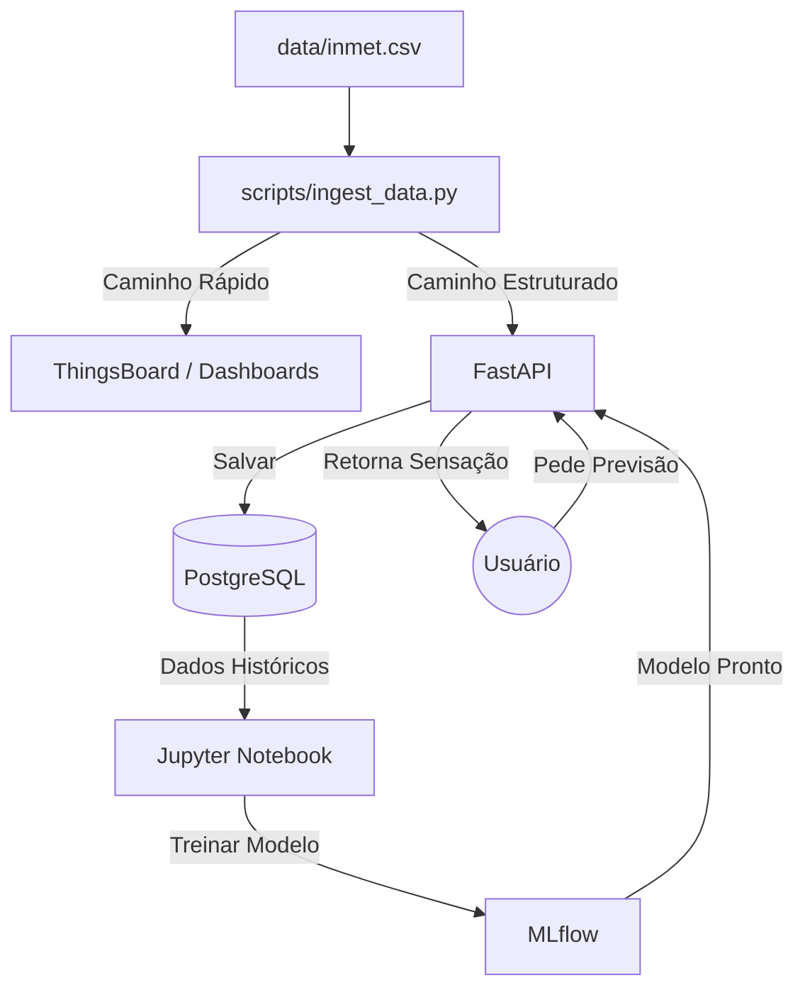

# 🔄 Fluxo de Dados e Arquitetura do Sistema

Este documento descreve o "Caso de Uso Real" do sistema, explicando como os dados fluem através dos componentes e qual o papel de cada um na arquitetura.

## 🎬 O Cenário: "Monitorando o Verão em Recife"

Imagine que você é um **Gestor de Monitoramento Climático**. Você possui dados brutos de uma estação meteorológica (INMET) e precisa responder: **"Qual a sensação térmica real e como ela vai evoluir?"**

---

## 🔄 O Fluxo Passo a Passo

### 1. A Fonte (O Dado Bruto)
*   **Onde:** Arquivo `data/inmet.csv` com colunas como Temperatura (30°C), Umidade (80%), Vento (5 m/s).
*   **Ação:** Executar `scripts/convert_inmet_data.py`.
*   **O que acontece:** O script limpa os dados, ajusta datas e cria um arquivo padronizado (`data/sample_thermal_data.csv`).
*   **Papel:** *Preparação da matéria-prima.*

### 2. A Ingestão (O Carteiro)
*   **Ação:** Executar `scripts/ingest_data.py`.
*   **O que acontece:** O script lê o arquivo limpo e realiza **duas entregas simultâneas** para cada registro:
    *   **Entrega A (Visualização):** Envia para o **ThingsBoard**. O dashboard atualiza em tempo real.
    *   **Entrega B (Histórico e ML):** Envia para a **API (FastAPI)** no endpoint `/thermal_comfort`.
*   **Papel:** *Distribuição de dados.*

### 3. O Processamento e Armazenamento (O Armazém)
*   **Onde:** **FastAPI** e **PostgreSQL**.
*   **O que acontece:**
    1.  A API recebe o dado.
    2.  Aplica uma **Fórmula Física** para calcular a sensação térmica atual (ex: Heat Index).
    3.  Salva os dados originais e calculados no **PostgreSQL** (tabela `thermal_measurements`).
*   **Papel:** *Persistência e Verdade Oficial (Single Source of Truth).*

### 4. O Laboratório de Inteligência (Treinamento)
*   **Onde:** **Jupyter Notebook** + **MLflow**.
*   **O que acontece:**
    1.  O Cientista de Dados acessa o Jupyter (`http://localhost:1010`).
    2.  Consome os dados históricos do PostgreSQL.
    3.  Treina um modelo (ex: Random Forest) para aprender padrões de conforto térmico.
    4.  O **MLflow** registra o experimento (métricas, parâmetros).
    5.  O modelo treinado (`model.pkl`) é salvo para uso futuro.
*   **Papel:** *Criar a inteligência (Cérebro).*

### 5. A Predição (A Mágica)
*   **Onde:** Endpoint `/prediction/predict` da **API**.
*   **Cenário:** Recebimento de uma previsão meteorológica futura.
*   **O que acontece:**
    1.  Usuário/Sistema envia dados previstos (ex: "Amanhã fará 32°C").
    2.  A API carrega o modelo treinado.
    3.  O modelo analisa e retorna: **"Sensação de 38°C - Zona: Muito Quente"**.
*   **Papel:** *Antecipar o futuro com base no aprendizado passado.*

### 6. A Visualização (O Painel de Controle)
*   **Onde:** **ThingsBoard** e **Trendz**.
*   **ThingsBoard:** Monitoramento em tempo real e alertas imediatos.
*   **Trendz:** Análise de tendências históricas, mapas de calor e padrões sazonais.
*   **Papel:** *Suporte à tomada de decisão.*

---

## 🧩 Resumo dos Componentes

| Componente | Nome Técnico | Papel no Sistema |
| :--- | :--- | :--- |
| **Fonte de Dados** | `data/inmet.csv` | Matéria-prima bruta. |
| **Ingestão** | `ingest_data.py` | Transporte e roteamento dos dados. |
| **API** | `FastAPI` | Processamento, cálculo e interface. |
| **Banco de Dados** | `PostgreSQL` | Armazenamento persistente e histórico. |
| **Rastreamento ML** | `MLflow` | Registro de experimentos e modelos. |
| **IoT Dashboard** | `ThingsBoard` | Visualização em tempo real e alertas. |
| **Analytics** | `Trendz` | Análise de negócios e padrões complexos. |

## 🗺️ Diagrama do Fluxo

