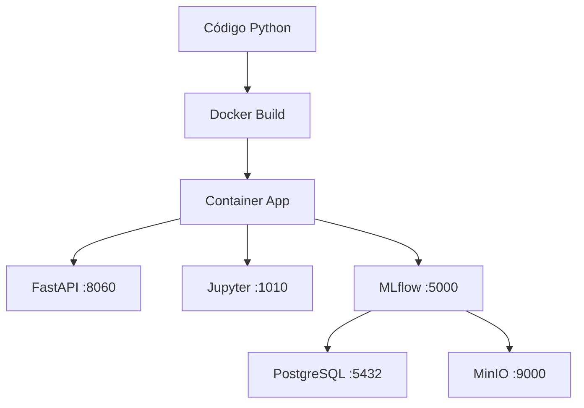

# 🐳 Docker - Guia de Configuração

## O que é Docker?

Docker é uma plataforma que permite **containerizar** aplicações, ou seja, empacotar sua aplicação junto com todas as dependências em containers isolados e portáveis.

### Por que usar Docker no seu projeto?

1. **Consistência**: Mesmo ambiente em desenvolvimento, teste e produção
2. **Isolamento**: Cada serviço roda em seu próprio container
3. **Facilidade**: Um comando para subir toda a infraestrutura
4. **Portabilidade**: Roda em qualquer máquina com Docker

## 📁 Arquivos Docker no Projeto

### 1. `Dockerfile`
Define como construir a imagem da sua aplicação Python:
- Base: Python 3.11
- Instala dependências do sistema
- Instala bibliotecas Python
- Configura o ambiente

### 2. `docker-compose.yml`
Orquestra todos os serviços:
- **app**: Sua aplicação principal (FastAPI + Jupyter)
- **mlflow**: Servidor MLflow para tracking
- **postgres**: Banco de dados
- **minio**: Armazenamento S3-compatível

### 3. `docker-manager.sh`
Script utilitário para gerenciar containers facilmente.

## 🚀 Como usar

### Primeira execução:
```bash
# 1. Construir as imagens
./docker-manager.sh build

# 2. Iniciar todos os serviços
./docker-manager.sh start
```

### Comandos úteis:
```bash
./docker-manager.sh start     # Iniciar serviços
./docker-manager.sh stop      # Parar serviços
./docker-manager.sh status    # Ver status
./docker-manager.sh logs      # Ver logs
./docker-manager.sh urls      # Ver URLs dos serviços
./docker-manager.sh shell     # Abrir terminal no container
```

## 🌐 Serviços Disponíveis

Após iniciar, você terá acesso a:

| Serviço | URL | Descrição |
|---------|-----|-----------|
| **FastAPI** | http://localhost:8060 | API REST da aplicação |
| **Jupyter** | http://localhost:1010 | Notebooks interativos |
| **MLflow** | http://localhost:5000 | Tracking de experimentos |
| **Trendz Analytics** | http://localhost:8888 | Analytics e visualização |
| **ThingsBoard** | http://localhost:8080 | Plataforma IoT |
| **MinIO Console** | http://localhost:9001 | Interface do storage |
| **PostgreSQL** | localhost:5432 | Banco de dados |

## 📊 Fluxo de Desenvolvimento



## 🔧 Configuração Avançada

### Variáveis de Ambiente
Copie `.env.example` para `.env` e ajuste conforme necessário:
```bash
cp .env.example .env
```

### Volumes Docker
Os dados são persistidos em volumes Docker:
- `postgres_data`: Dados do PostgreSQL
- `minio_data`: Arquivos do MinIO
- `mlflow_data`: Dados do MLflow
- `avd_data`: Dados da aplicação

## 🐛 Troubleshooting

### Problema: Porta já em uso
```bash
# Ver processos usando a porta
sudo lsof -i :8060

# Parar containers e tentar novamente
./docker-manager.sh stop
./docker-manager.sh start
```

### Problema: Container não inicia
```bash
# Ver logs detalhados
./docker-manager.sh logs

# Reconstruir imagens
./docker-manager.sh build
```

### Problema: Banco de dados vazio
```bash
# Entrar no container do postgres
docker-compose exec postgres psql -U user -d mlflow

# Verificar tabelas
\dt
```

## 📚 Próximos Passos

1. ✅ **Docker configurado**
2. 🔄 **MLflow**: Tracking de experimentos
3. 🔄 **FastAPI**: API REST
4. 🔄 **Trendz Analytics**: Dashboards
5. 🔄 **Snowflake**: Data warehouse

## 💡 Dicas

- Use `./docker-manager.sh shell` para debuggar dentro do container
- Logs ficam em `./docker-manager.sh logs`
- Para reset completo: `./docker-manager.sh clean` (⚠️ Remove todos os dados!)
- Jupyter token: `./docker-manager.sh jupyter`